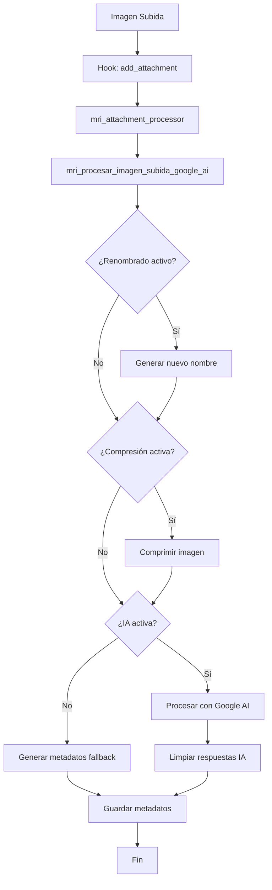
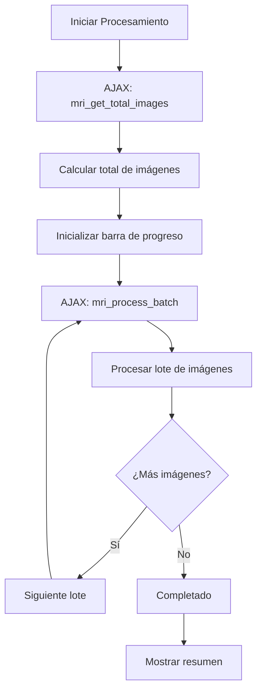
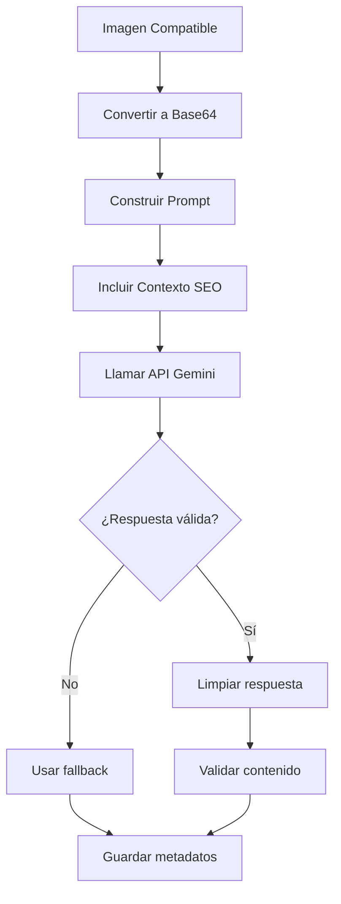

# Documentación Técnica - Toc Toc SEO Images

## 📖 Índice

1. [Arquitectura del Plugin](#arquitectura-del-plugin)
2. [Estructura de Archivos](#estructura-de-archivos)
3. [API y Configuración](#api-y-configuración)
4. [Flujo de Procesamiento](#flujo-de-procesamiento)
5. [Funciones Principales](#funciones-principales)
6. [Sistema de Hooks](#sistema-de-hooks)
7. [Base de Datos](#base-de-datos)
8. [Internacionalización](#internacionalización)
9. [Seguridad](#seguridad)
10. [Performance](#performance)
11. [Extensibilidad](#extensibilidad)

---

## 🏗️ Arquitectura del Plugin

### Patrón de Diseño
El plugin sigue una **arquitectura modular** basada en:
- **Separación de responsabilidades**
- **WordPress Settings API**
- **AJAX para procesamiento asíncrono**
- **Sistema de hooks y filtros**

### Componentes Principales

```
mi-renombrador-imagenes/
├── mi-renombrador-imagenes.php    # Archivo principal
├── admin-batch.js                 # JavaScript para procesamiento masivo
├── languages/                     # Archivos de traducción
└── docs/                         # Documentación
```

### Módulos del Sistema

#### 1. **Módulo de Configuración**
- Gestión de opciones del plugin
- Interfaz de administración
- Validación y sanitización de datos

#### 2. **Módulo de IA (Google AI)**
- Integración con Gemini Vision API
- Procesamiento de imágenes con IA
- Limpieza y formato de respuestas

#### 3. **Módulo de Procesamiento Masivo**
- Sistema AJAX para lotes
- Gestión de progreso y logs
- Control de timeouts y memoria

#### 4. **Módulo de Compresión**
- Soporte Imagick/GD
- Optimización por tipo MIME
- Preservación de calidad visual

---

## 📁 Estructura de Archivos

### Archivo Principal: `mi-renombrador-imagenes.php`

```php
<?php
/**
 * Plugin Name: Toc Toc SEO Images
 * Version: 3.6.0
 * Description: Plugin completo de optimización de imágenes
 */

// Secciones del código:
// 1. Configuración y Página de Ajustes (líneas ~30-300)
// 2. Ayudante IA - Google AI Gemini (líneas ~300-450)
// 3. Procesamiento Masivo (líneas ~450-650)
// 4. Lógica Principal de Procesamiento (líneas ~650-1200)
// 5. Funciones Auxiliares (líneas ~1200+)
```

### JavaScript: `admin-batch.js`

```javascript
// Gestión de interfaz AJAX para procesamiento masivo
// - Control de inicio/parada
// - Actualización de progreso
// - Manejo de logs en tiempo real
// - Gestión de errores
```

---

## ⚙️ API y Configuración

### Constantes del Plugin

```php
define('MRI_SETTINGS_OPTION_NAME', 'mri_google_ai_options');
define('MRI_PLUGIN_SLUG', 'mi-renombrador-imagenes');
```

### Opciones de Configuración

```php
$default_options = [
    // Configuración General
    'enable_rename'            => 1,
    'enable_compression'       => 1,
    'jpeg_quality'             => 85,
    'use_imagick_if_available' => 1,
    
    // Metadatos
    'enable_alt'               => 1,
    'overwrite_alt'            => 1,
    'enable_caption'           => 1,
    'overwrite_caption'        => 0,
    
    // Google AI
    'gemini_api_key'           => '',
    'gemini_model'             => 'gemini-1.5-flash-latest',
    'ai_output_language'       => 'es',
    'enable_ai_title'          => 0,
    'enable_ai_alt'            => 0,
    'enable_ai_caption'        => 0,
    'include_seo_in_ai_prompt' => 1,
];
```

### Integración con Google AI

#### Endpoint API
```php
$api_url = 'https://generativelanguage.googleapis.com/v1beta/models/' 
         . $model . ':generateContent?key=' . $api_key;
```

#### Configuración de Seguridad
```php
'safetySettings' => [
    ['category' => 'HARM_CATEGORY_HARASSMENT', 'threshold' => 'BLOCK_MEDIUM_AND_ABOVE'],
    ['category' => 'HARM_CATEGORY_HATE_SPEECH', 'threshold' => 'BLOCK_MEDIUM_AND_ABOVE'],
    ['category' => 'HARM_CATEGORY_SEXUALLY_EXPLICIT', 'threshold' => 'BLOCK_MEDIUM_AND_ABOVE'],
    ['category' => 'HARM_CATEGORY_DANGEROUS_CONTENT', 'threshold' => 'BLOCK_MEDIUM_AND_ABOVE']
]
```

---

## 🔄 Flujo de Procesamiento

### 1. Subida Nueva de Imagen



### 2. Procesamiento Masivo



### 3. Análisis con IA



---

## 🔧 Funciones Principales

### Core Functions

#### `mri_procesar_imagen_subida_google_ai($attachment_id, $is_bulk_process = false)`
**Función principal de procesamiento**

```php
/**
 * Procesa imagen: renombra, comprime, genera metadatos con IA
 * 
 * @param int  $attachment_id    ID del adjunto
 * @param bool $is_bulk_process  Indica si es procesamiento masivo
 * @return string|void          Mensaje de log para bulk, nada para upload normal
 * @throws Exception            Error en procesamiento masivo
 */
```

**Flujo interno:**
1. Validación de opciones y archivo
2. Generación de título con IA (si activo)
3. Renombrado de archivo (si activo)
4. Compresión de imagen (si activo)
5. Generación de Alt Text
6. Generación de Caption/Leyenda

#### `mri_llamar_google_ai_api($prompt, $api_key, $model, $max_tokens, $image_data_base64, $image_mime_type)`
**Interfaz con Google AI**

```php
/**
 * Comunicación con Gemini Vision API
 * 
 * @param string $prompt              Texto del prompt
 * @param string $api_key             Clave API de Google
 * @param string $model               Modelo Gemini a usar
 * @param int    $max_tokens          Límite de tokens en respuesta
 * @param string $image_data_base64   Imagen codificada en base64
 * @param string $image_mime_type     Tipo MIME de la imagen
 * @return string|false              Texto generado o false en error
 */
```

#### `mri_clean_ai_response($text)`
**Limpieza de respuestas IA**

```php
/**
 * Elimina frases introductorias y formato innecesario
 * 
 * Patrones eliminados:
 * - "Aquí tienes...", "Este es...", "Un texto alternativo..."
 * - Markdown (**texto**)
 * - Comillas externas
 * - Metadatos de redes sociales (Instagram, TikTok, etc.)
 * 
 * @param string $text Texto a limpiar
 * @return string     Texto limpio
 */
```

### Compression Functions

#### Imagick Compression
```php
$imagick = new Imagick($file_path);
$format = $imagick->getImageFormat();

switch ($format) {
    case 'JPEG':
        $imagick->setImageCompression(Imagick::COMPRESSION_JPEG);
        $imagick->setImageCompressionQuality($quality);
        break;
    case 'PNG':
        $imagick->setImageCompression(Imagick::COMPRESSION_ZIP);
        $imagick->setImageCompressionQuality(9);
        break;
    case 'WEBP':
        $imagick->setImageFormat('WEBP');
        $imagick->setImageCompressionQuality($quality);
        break;
}

$imagick->stripImage(); // Eliminar EXIF
$imagick->writeImage($file_path);
```

#### GD Fallback
```php
switch ($mime_type) {
    case 'image/jpeg':
        $image = imagecreatefromjpeg($file_path);
        imagejpeg($image, $file_path, $quality);
        break;
    case 'image/png':
        $image = imagecreatefrompng($file_path);
        imagealphablending($image, false);
        imagesavealpha($image, true);
        imagepng($image, $file_path, 9);
        break;
}
```

---

## 🎣 Sistema de Hooks

### WordPress Hooks Utilizados

```php
// Configuración
add_action('admin_menu', 'mri_google_ai_add_admin_menu');
add_action('admin_init', 'mri_google_ai_settings_init');
add_action('admin_enqueue_scripts', 'mri_enqueue_bulk_scripts');

// Procesamiento
add_action('add_attachment', 'mri_attachment_processor', 20, 1);

// AJAX
add_action('wp_ajax_mri_get_total_images', 'mri_ajax_get_total_images_callback');
add_action('wp_ajax_mri_process_batch', 'mri_ajax_process_batch_callback');

// Internacionalización
add_action('plugins_loaded', 'mri_google_ai_load_textdomain');
```

### Custom Hooks (Extensibilidad)

```php
// Filtros para desarrolladores
$attachment_id = apply_filters('mri_before_process_image', $attachment_id);
$generated_title = apply_filters('mri_ai_generated_title', $title, $attachment_id);
$compressed_path = apply_filters('mri_after_compression', $file_path, $attachment_id);

// Acciones para desarrolladores
do_action('mri_image_processed', $attachment_id, $log_summary);
do_action('mri_batch_completed', $processed_count, $total_images);
```

---

## 💾 Base de Datos

### Opciones de WordPress
```php
// Tabla: wp_options
option_name: 'mri_google_ai_options'
option_value: serialize([
    'enable_rename' => 1,
    'gemini_api_key' => 'encrypted_key',
    // ... resto de opciones
])
```

### Post Meta
```php
// Tabla: wp_postmeta
'_wp_attachment_image_alt'    // Alt text de la imagen
'_wp_attached_file'           // Ruta relativa del archivo
'_mri_processing_bulk'        // Flag temporal para bulk processing
'_mri_processing_upload'      // Flag temporal para upload processing
```

### Attachment Post Data
```php
// Tabla: wp_posts (post_type = 'attachment')
'post_title'   // Título generado por IA o fallback
'post_excerpt' // Caption/Leyenda generada
'post_content' // Descripción (no utilizada actualmente)
```

---

## 🌍 Internacionalización

### Idiomas Soportados
```php
$supported_languages = [
    'es' => 'Español',
    'en' => 'Inglés', 
    'fr' => 'Francés',
    'de' => 'Alemán',
    'it' => 'Italiano',
    'pt' => 'Portugués'
];
```

### Text Domain
```php
load_plugin_textdomain(
    'mi-renombrador-imagenes', 
    false, 
    dirname(plugin_basename(__FILE__)) . '/languages/'
);
```

### Prompts Multiidioma
```php
$prompt_titulo = sprintf(
    __('Generate the response in %1$s. Analyze this image...', 'mi-renombrador-imagenes'),
    $ai_language_name,
    $contexto
);
```

---

## 🔒 Seguridad

### Validación de Entrada
```php
// Sanitización de opciones
function mri_google_ai_options_sanitize($input) {
    $sanitized = [];
    
    // API Key
    $sanitized['gemini_api_key'] = sanitize_text_field(trim($input['gemini_api_key']));
    
    // Calidad JPEG (0-100)
    $quality = absint($input['jpeg_quality']);
    $sanitized['jpeg_quality'] = max(0, min(100, $quality));
    
    // Idioma (lista blanca)
    $lang = sanitize_key($input['ai_output_language']);
    $sanitized['ai_output_language'] = array_key_exists($lang, $supported_languages) 
        ? $lang 
        : 'es';
    
    return $sanitized;
}
```

### Verificación de Permisos
```php
// AJAX Callbacks
check_ajax_referer('mri_bulk_process_nonce', 'nonce');
if (!current_user_can('manage_options')) {
    wp_send_json_error(['message' => 'Permiso denegado'], 403);
}

// Páginas de admin
if (!current_user_can('manage_options')) {
    wp_die('No tienes permisos suficientes');
}
```

### Validación de Archivos
```php
// Tipos MIME permitidos
$allowed_types = ['image/jpeg', 'image/png', 'image/webp', 'image/gif', 'image/avif', 'image/svg+xml'];

// Verificación de existencia y permisos
if (!file_exists($file_path) || !is_readable($file_path)) {
    throw new Exception('Archivo no accesible');
}
```

---

## ⚡ Performance

### Optimizaciones Implementadas

#### 1. **Gestión de Memoria**
```php
// Aumento temporal de memoria para procesamiento
ini_set('memory_limit', '256M');

// Liberación de recursos
unset($image_data_base64);
imagedestroy($image_resource);
$imagick->clear();
$imagick->destroy();
```

#### 2. **Control de Timeouts**
```php
// Aumento de tiempo límite
if (function_exists('set_time_limit')) {
    @set_time_limit(300); // 5 minutos
}

// Pausas entre imágenes en bulk
sleep(1); // Evitar saturación de API
```

#### 3. **Optimización de Lotes**
```php
// Tamaño dinámico de lote según tipo de procesamiento
$intensive_task = $options['enable_compression'] || 
                  $options['enable_ai_title'] || 
                  $options['enable_ai_alt'] || 
                  $options['enable_ai_caption'];
                  
$batch_size = $intensive_task ? 3 : 10;
```

#### 4. **Cache Management**
```php
// Limpiar cache antes de procesar
wp_cache_delete($attachment_id, 'posts');
wp_cache_delete($attachment_id, 'post_meta');

// Limpiar cache de archivos
clearstatcache();
```

### Monitoring de Performance
```php
// Logging de tiempos de ejecución
$start_time = microtime(true);
// ... procesamiento
$execution_time = microtime(true) - $start_time;
error_log("MRI Processing time for ID $attachment_id: {$execution_time}s");
```

---

## 🔌 Extensibilidad

### Filtros para Desarrolladores

#### Modificar Proceso de Imagen
```php
// Antes del procesamiento
add_filter('mri_before_process_image', function($attachment_id) {
    // Lógica personalizada
    return $attachment_id;
});

// Modificar título generado por IA
add_filter('mri_ai_generated_title', function($title, $attachment_id) {
    // Personalizar título
    return $title . ' - Custom Suffix';
}, 10, 2);
```

#### Personalizar Compresión
```php
// Modificar configuración de compresión
add_filter('mri_compression_quality', function($quality, $mime_type) {
    if ($mime_type === 'image/webp') {
        return 95; // Mayor calidad para WebP
    }
    return $quality;
}, 10, 2);
```

### Acciones para Desarrolladores

#### Logging Personalizado
```php
// Después de procesar imagen
add_action('mri_image_processed', function($attachment_id, $log_summary) {
    // Log personalizado
    custom_log("Processed image: $attachment_id - " . implode(', ', $log_summary));
}, 10, 2);

// Al completar lote masivo
add_action('mri_batch_completed', function($processed_count, $total) {
    // Notificación personalizada
    wp_mail(get_option('admin_email'), 'Batch Complete', "Processed $processed_count of $total images");
}, 10, 2);
```

### Extensión de Idiomas
```php
// Añadir idiomas personalizados
add_filter('mri_supported_languages', function($languages) {
    $languages['ca'] = 'Català';
    $languages['eu'] = 'Euskera';
    return $languages;
});
```

### API Externa Personalizada
```php
// Reemplazar Google AI con API personalizada
add_filter('mri_ai_api_call', function($result, $prompt, $image_data) {
    // Implementar API personalizada
    return custom_ai_api($prompt, $image_data);
}, 10, 3);
```

---

## 🐛 Debugging y Logs

### Sistema de Logging
```php
// Error logging
error_log("MRI Plugin: Error details here");

// Debug condicional
if (defined('WP_DEBUG') && WP_DEBUG) {
    error_log("MRI Debug: Processing ID $attachment_id");
}
```

### Códigos de Estado del Log
- **success**: Operación completada exitosamente
- **error**: Error crítico que impide el procesamiento
- **notice**: Advertencia o información importante
- **info**: Información general del proceso

### Debugging AJAX
```javascript
// En admin-batch.js
console.log('MRI Batch:', response);
if (window.mri_debug) {
    console.table(response.logMessages);
}
```

---

## 📈 Métricas y Monitoreo

### KPIs del Plugin
- **Tiempo de procesamiento por imagen**
- **Reducción de tamaño promedio**
- **Tasa de éxito de API calls**
- **Memoria utilizada por lote**

### Implementación de Métricas
```php
// Tracking de compresión
$original_size = filesize($file_path);
// ... compresión
$new_size = filesize($file_path);
$compression_ratio = round((1 - $new_size / $original_size) * 100);

update_option('mri_compression_stats', [
    'total_processed' => get_option('mri_total_processed', 0) + 1,
    'total_saved_bytes' => get_option('mri_total_saved', 0) + ($original_size - $new_size),
    'average_compression' => $compression_ratio
]);
```

---

## 🚀 Roadmap y Futuras Mejoras

### Próximas Funcionalidades
1. **Soporte para más formatos**: HEIC, TIFF
2. **Conversión automática de formatos**: JPG → WebP
3. **Lazy loading integration**
4. **CDN integration**
5. **Backup automático antes de compresión**

### Optimizaciones Técnicas
1. **Queue system** para procesamiento en background
2. **Cron jobs** para procesamiento programado
3. **API REST** para integración externa
4. **Multisite compatibility**

---

*Documentación actualizada para la versión 3.6.0*  
*Última actualización: [Fecha actual]*

